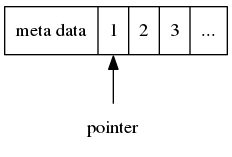

# SmartPtr
C++ smart pointer library with GC


It's hard for C++ to manange memory, because of the downward compatibility for C. We usually use smart pointer based on reference count to prevent the memory leak, but it's useless when come across the circular reference.

So I want to design a kind of smart pointer with GC, that sometimes will free the memory which is in the status of circular reference. 


## Design

The fundamental of this smart pointer is the reference count, but we store the reference number in front of the memory.



We have a global singleton manager to alloc memory. When the smart pointer were constructed on the stack, it would register the pointer to the manager.

```c

struct node_meta {
    size_t size;
    void* prev;
    void* next;
    size_t ref;
}

```
